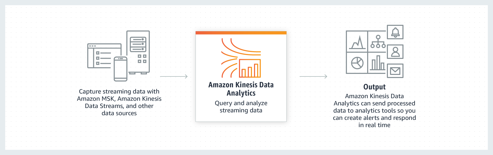

# kda-flink-demo
Hands-on guide to use Apache Flink app in Kinesis Data Analytics to aggregate time-series data with tumbling & sliding window in real-time.

## What is the architecture of Kinesis Data Analytics with Apache Flink?


## What is a 'Tumbling Window'?

A tumbling windows assigner assigns each element to a window of a specified window size. Tumbling windows have a fixed size and do not overlap. For example, if you specify a tumbling window with a size of 5 minutes, the current window will be evaluated and a new window will be started every five minutes as illustrated by the following figure.


## What does the incoming data look like?
**Will be generated by the send.py and sent to Kinesis Data Stream.**
```
[
    {
      "type": "Feature",
      "properties": {
        "RECEIVED_ON": "2020-09-14T09:20:22.385",
        "N02_001": "14",
        "N02_002": "5",
        "N02_003": "北海道新幹線",
        "N02_004": "西日本旅客鉄道",
        "ID": "5_14",
        "COUNT": 20
      }
    },
    {
      "type": "Feature",
      "properties": {
        "RECEIVED_ON": "2020-09-14T09:22:25.325",
        "N02_001": "14",
        "N02_002": "5",
        "N02_003": "北海道新幹線",
        "N02_004": "西日本旅客鉄道",
        "ID": "5_14",
        "COUNT": 30
      }
    }
    ...
]
```

## What does the aggregated tumbling data look like?


## 1. Create Aurora PostgreSQL Serverless Cluster

### 1-1. Create DB Subnet Group and Cluster
```
aws rds create-db-subnet-group \
--db-subnet-group-name database-vpc-subnet-group \
--db-subnet-group-description database_vpc_subnet_group \
--subnet-ids <subnet_id_1> <subnet_id_2> <subnet_id_3>

aws rds create-db-cluster --db-cluster-identifier sls-postgres \
--engine aurora-postgresql --engine-version 10.7 --engine-mode serverless \
--scaling-configuration MinCapacity=2,MaxCapacity=4 \
--enable-http-endpoint \
--master-username <username> --master-user-password <password> \
--enable-http-endpoint \
--db-subnet-group-name database-vpc-subnet-group \
--vpc-security-group-ids <security-group-id>

```

### 1-2. Create secret
```
aws secretsmanager create-secret --name sls-postgres-secret --secret-string "file://creds-sls-postgres.json"
```

### 1-3. Create Database 'monitoring'
```
$ aws rds-data execute-statement --resource-arn "<cluster-arn>" --secret-arn "<secret-arn>" --sql "SELECT datname FROM pg_database" --database "postgres"

$ aws rds-data execute-statement --resource-arn "<cluster-arn>" --secret-arn "<secret-arn>" --sql "CREATE DATABASE monitoring" --database "postgres"
```

### 1-4. Create Table 'Tumbling'
```
$ aws rds-data execute-statement --resource-arn "<cluster-arn>" --secret-arn "<secret-arn>" --sql "create table tumbling(RAILWAY_CLASS varchar(20), RAILWAY_CLASS_COUNT bigint, WINDOW_START timestamp, WINDOW_END timestamp, RECEIVED_ON timestamp, PRIMARY KEY(RAILWAY_CLASS, WINDOW_START, WINDOW_END))" --database "monitoring"
```

## 2. Create local flink-connector-kinesis repo
### 2-1. Download and Build Flink 1.8.2
```
curl -LJO https://github.com/apache/flink/archive/release-1.8.2.zip && unzip flink-release-1.8.2.zip && cd flink-release-1.8.2

mvn clean install -Pinclude-kinesis -DskipTests -pl flink-connectors/flink-connector-kinesis
```

## 2-2. Build this repo
* The built shaded jar file is under the target folder.
```
mvn package -Dflink.version=1.8.2
```

## 3. Create and run the KDA application
*Follow the AWS official document*
[Create and Run the Application (Console)](https://docs.aws.amazon.com/kinesisanalytics/latest/java/get-started-exercise.html#get-started-exercise-7-console)

### 3-1. Application Properties Groups
#### 3-1-1. Group ID: JobConfigProperties
* Key: "JOB_CLASS_NAME", Value: "StreamJobSqlTumbling"

#### 3-1-1. Group ID: SourceConfigProperties
* Key: "AWS_REGION", Value: "< your-aws-region >"
* Key: "INPUT_STREAM_NAME", Value: "kda_geojson"
* Key: "STREAM_INITIAL_POSITION", Value: "LATEST"

#### 3-1-2. Group ID: SinkConfigProperties
* Key: "DATABASE", Value: The database name set as 'monitoring' from 1-6 
* Key: "RESOURCE_ARN", Value: The datbase cluster ARN from 1-1
* Key: "SECRET_ARN", Value: The secret ARN from 1-2
* Key: "THRESHOLD", Value: 4

#### 3-1-3. Group ID: ProcessorConfigProperties
* Key: "CHECKPOINT_INTERVAL", Value: 30000
* Key: "INTERVAL_AMOUNT", Value: 1
* Key: "INTERVAL_UOM", Value: "MINUTE(2)"

### 3-2. Update Service execution IAM role
*Default role name kinesis-analytics-flink-analytics-monitoring-< your-region >*

#### 3-2-1. Add inline policy 'read-all-secret' to read secrets
```
{
    "Version": "2012-10-17",
    "Statement": [
        {
            "Action": [
                "secretsmanager:GetSecretValue"
            ],
            "Resource": [
                "*"
            ],
            "Effect": "Allow"
        }
    ]
}
```

#### 3-2-2. Add inline policy 'read-all-stream' to read streams
```
{
    "Version": "2012-10-17",
    "Statement": [
        {
            "Sid": "ReadInputStream",
            "Effect": "Allow",
            "Action": "kinesis:*",
            "Resource": "*"
        }
    ]
}
```

#### 3-2-3. Add inline policy 'use-all-dataapi' to access Data API of Aurora Serverless
```
{
    "Version": "2012-10-17",
    "Statement": [
        {
            "Action": [
                "rds-data:BatchExecuteStatement",
                "rds-data:BeginTransaction",
                "rds-data:CommitTransaction",
                "rds-data:ExecuteStatement",
                "rds-data:RollbackTransaction",
                "rds-data:DeleteItems",
                "rds-data:ExecuteSql",
                "rds-data:GetItems",
                "rds-data:InsertItems",
                "rds-data:UpdateItems"
            ],
            "Resource": [
                "*"
            ],
            "Effect": "Allow"
        }
    ]
}
```

### 3-3. Run and tets

#### 3-3-1. Start the flink application

#### 3-3-2. Create a new Kinesis Data Stream called 'kda_geojson'

#### 3-3-3. Check the aggregated data in Aurora
```
select * from tumbling
```

---------------
## 4. References
### 4-1. AWS Official KDA Examples
#### Example: Using a Custom Sink to Write to CloudWatch Logs
https://docs.aws.amazon.com/en_pv/kinesisanalytics/latest/java/examples-cloudwatch.html

#### Example: Sliding Window
https://docs.aws.amazon.com/en_pv/kinesisanalytics/latest/java/examples-sliding.html

### 4-2. DataStream API Examples
#### Java Code Examples for org.apache.flink.streaming.api.functions.sink.SinkFunction
https://www.programcreek.com/java-api-examples/?api=org.apache.flink.streaming.api.functions.sink.SinkFunction

#### Amazon Kinesis Data Analytics Java Examples
https://github.com/aws-samples/amazon-kinesis-data-analytics-java-examples

#### Build and run streaming applications with Apache Flink and Amazon Kinesis Data Analytics for Java Applications
https://github.com/aws-samples/amazon-kinesis-analytics-taxi-consumer
https://aws.amazon.com/blogs/big-data/build-and-run-streaming-applications-with-apache-flink-and-amazon-kinesis-data-analytics-for-java-applications/

### 4-3. DataStream API Examples - Custom Aggregate Function
#### Apache FlinkとJava 8でセンサーデータをウィンドウ集計をする
https://qiita.com/masato/items/32d84f117152ea0fdb0b

#### Hands-on with Event Stream Processing Frameworks
https://medium.com/@cjolif/hands-on-with-event-stream-processing-frameworks-8be69101a1c8
https://github.com/cjolif/streaming-examples/blob/master/flink/src/main/java/Example.java

### 4-4. Table/SQL API Examples
#### Amazon Kinesis Data Analytics for Java - Leveraging the Apache Flink Table Api
https://github.com/aws-samples/amazon-kinesis-data-analytics-flinktableapi

#### Simple aggregation from a CSV
https://riptutorial.com/apache-flink/example/27901/simple-aggregation-from-a-csv

### 4-5. Custom Sink Examples
#### Writing to PostgreSQL from Apache Flink
https://tech.signavio.com/2017/postgres-flink-sink

### 4-6. Tools
#### Amazon Kinesis Data Generator
https://awslabs.github.io/amazon-kinesis-data-generator/web/help.html

#### Importing Flink into an IDE
https://ci.apache.org/projects/flink/flink-docs-stable/flinkDev/ide_setup.html

### 4-7. Flink Official Doc
#### DataStream API
https://ci.apache.org/projects/flink/flink-docs-release-1.8/dev/stream/operators/
https://ci.apache.org/projects/flink/flink-docs-release-1.8/dev/stream/operators/windows.html

#### Table/SQL API
https://ci.apache.org/projects/flink/flink-docs-release-1.8/dev/table/tableApi.html
https://ci.apache.org/projects/flink/flink-docs-release-1.8/dev/table/sql.html

### 4-8. Flink Overview
#### flink-api-table-api-and-sql
https://www.infoq.cn/article/flink-api-table-api-and-sql

#### Java Doc
https://ci.apache.org/projects/flink/flink-docs-release-1.8/api/java/org/apache/flink/streaming/api/datastream/DataStream.html
https://ci.apache.org/projects/flink/flink-docs-release-1.8/api/java/org/apache/flink/streaming/api/datastream/KeyedStream.html
https://ci.apache.org/projects/flink/flink-docs-release-1.8/api/java/org/apache/flink/streaming/api/datastream/WindowedStream.html